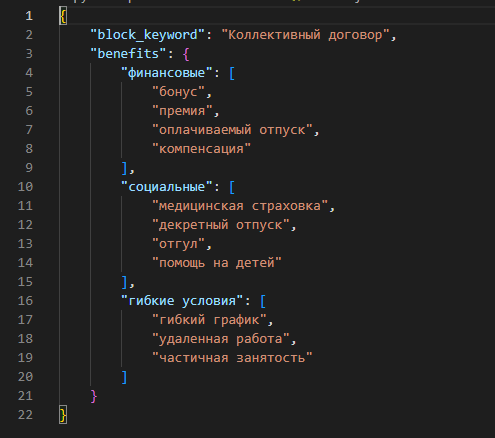

## Парсер документов docx

#### Скрипт ведет подсчет ключевых слов или словосочетаний в документах формата docx. После подсчета создается файл со списком ключевых слов и количеством единичных появлений таких слов в текстовом фрагменте. 

* Скрипт "AnaliticTextUnion.exe" должен находится в папке с JSON-файлом "benefits.json".

* Файл "benefits.json" содержит ключевое слово для определения блоков текста (часть заголовоков), категорий и искомых значений.

* После запуска, скрипт попроит выбрать документ (.docx) для поиска.

* После завершения работы скрипта в папке будет создан файл "report.docx" со списком найденых значений. 
